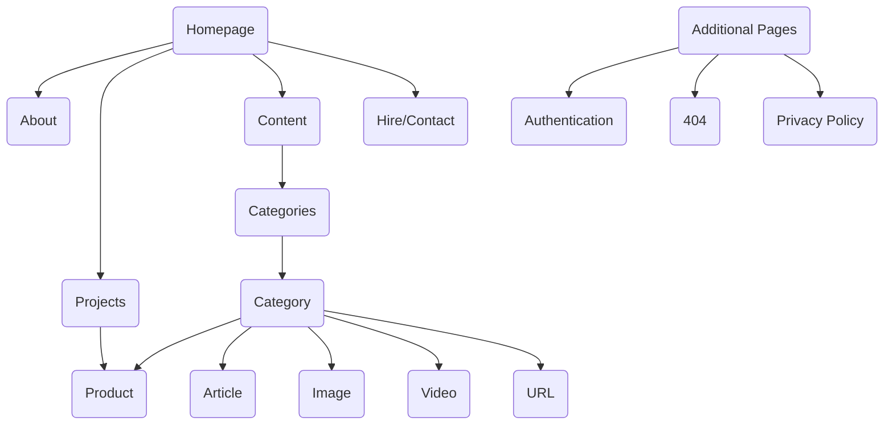

# Portfolio

## [](https://app.netlify.com/sites/radiant-choux-7aba5d/deploys) — [ Live Deployment](https://radiant-choux-7aba5d.netlify.app/) — [ Open in Figma](https://www.figma.com/file/N3t38qnVsBG5MFeYvP5p4x/FI6-Portfolio-Template-Made-by-Fin?node-id=0-1&t=6hYwn2zwh31VdVat-0)

A portfolio website built using Next.js, TypeScript, Tailwind CSS, and Markdown. The website is designed to showcase and distribute my work and publications.


## Technologies

- [Next.js](http://next.js/)
- [Tailwinds](http://tailwinds.com/)
- [TypeScript](http://typejs.org/)
- [Markdown](http://markdown.org/)
- [MongoDB](http://mongodb.org/)

---

## Sitemap



---

## Installation

1. Install the dependencies:

    ```bash
    npm i
    # or
    yarn
    ```

2. Run the development server:

    ```bash
    npm run dev
    # or
    yarn dev
    ```

Open [http://localhost:3000](http://localhost:3000) with your browser to see the result.
