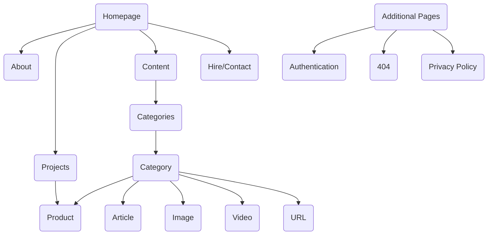

# Portfolio

A portfolio website built using Next.js, TypeScript, Tailwind CSS, and Markdown. The website is designed to showcase and distribute my work and publications.

## Technologies

- [Next.js](http://next.js/)
- [Tailwinds](http://tailwinds.com/)
- [TypeScript](http://typejs.org/)
- [Markdown](http://markdown.org/)
- [MongoDB](http://mongodb.org/)

---

## Sitemap



## Pages

- [Homepage](./src/pages/index.tsx): The homepage that introduces myself and provides links to the other pages.

- [About](./src/pages/index.tsx): The about page where visitors can learn more about my background and experience.

- [Projects](./src/pages/index.tsx): The projects page that showcases some of the projects I have worked on.

- [Categories](./src/pages/index.tsx): The content page that displays all the content items of a particular category, such as articles, images, videos, and products.

- [Category](./src/pages/index.tsx): The page that displays a single content item specified by the slug in the URL.

- [Hire Me/Contact](./src/pages/index.tsx): The hire/contact page where visitors can contact me for inquiries, work opportunities, or collaborations.

- [404](./src/pages/index.tsx): The custom 404 page that is displayed when a visitor tries to access a page that does not exist.

- [Auth](./src/pages/index.tsx): The authentication page that allows visitors to sign in to access protected content.

- [Privacy Policy](./src/content/privacy-policy.md): The privacy policy page that explains how I handle and protect the personal information of my visitors.

---

## Installation

1. Install the dependencies:

    ```bash
    npm i
    # or
    yarn
    ```

2. Run the development server:

    ```bash
    npm run dev
    # or
    yarn dev
    ```

Open [http://localhost:3000](http://localhost:3000) with your browser to see the result.
